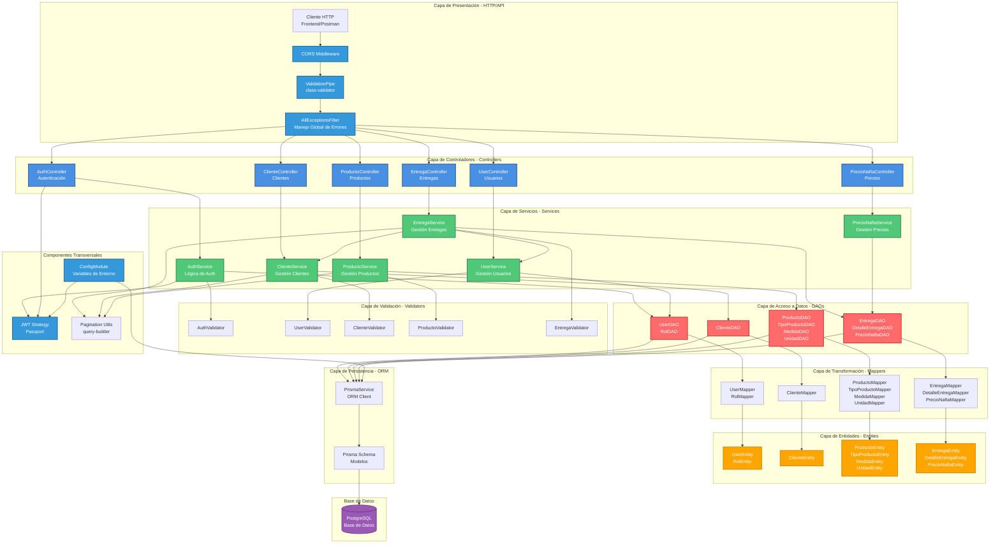

# Arquitectura del Sistema RINPA Backend

Este documento describe la arquitectura completa del sistema RINPA Backend, mostrando las distintas capas, módulos y sus interacciones.

## Diagrama de Arquitectura General



## Descripción de Capas

### 1. Capa de Presentación (HTTP/API)
- **Responsabilidad**: Manejo de peticiones HTTP entrantes
- **Componentes**:
  - CORS Middleware: Control de acceso cross-origin
  - ValidationPipe: Validación automática de DTOs usando class-validator
  - AllExceptionsFilter: Captura y formatea todas las excepciones

### 2. Capa de Controladores (Controllers)
- **Responsabilidad**: Recepción de peticiones HTTP y enrutamiento
- **Módulos**:
  - **Auth**: Autenticación y generación de tokens JWT
  - **User**: Gestión de usuarios y roles
  - **Cliente**: CRUD de clientes
  - **Producto**: Gestión de productos, tipos, medidas y unidades
  - **Entrega**: Gestión de entregas, detalles y precios de nafta

### 3. Capa de Servicios (Services)
- **Responsabilidad**: Lógica de negocio y orquestación
- **Características**:
  - Validación de reglas de negocio
  - Coordinación entre DAOs
  - Transformación de datos cuando es necesario

### 4. Capa de Validación (Validators)
- **Responsabilidad**: Validación de reglas de negocio específicas
- **Ejemplos**:
  - Verificar existencia de entidades relacionadas
  - Validar unicidad de campos
  - Validar estados y transiciones

### 5. Capa de Acceso a Datos (DAOs)
- **Responsabilidad**: Abstracción del acceso a datos
- **Patrón**: Repository Pattern
- **Características**:
  - Interfaces (IDAO) para desacoplamiento
  - Implementaciones específicas de Prisma
  - Inclusión de relaciones para evitar N+1

### 6. Capa de Transformación (Mappers)
- **Responsabilidad**: Transformación entre modelos de datos
- **Tipos**:
  - **DAO Mappers**: Prisma Models → Entities
  - **Response Mappers**: Entities → DTOs de respuesta

### 7. Capa de Entidades (Entities)
- **Responsabilidad**: Representación del dominio
- **Características**:
  - Encapsulación de lógica de dominio
  - Getters/Setters controlados
  - Relaciones opcionales para optimización

### 8. Capa de Persistencia (ORM)
- **Responsabilidad**: Abstracción de la base de datos
- **Tecnología**: Prisma ORM
- **Características**:
  - Type-safe queries
  - Migrations automáticas
  - Schema centralizado

### 9. Base de Datos
- **Tecnología**: PostgreSQL
- **Características**:
  - Relaciones bien definidas
  - Soft delete implementado
  - Índices en campos críticos

## Componentes Transversales

### JWT Strategy
- Autenticación basada en tokens
- Integración con Passport
- Protección de rutas mediante guards

### ConfigModule
- Gestión centralizada de configuración
- Variables de entorno
- Validación de configuración

### Pagination Utils
- Utilidades reutilizables para paginación
- Soporte para filtros dinámicos
- Query builder genérico

## Flujo de Datos Típico

1. **Request HTTP** → Cliente envía petición
2. **Middleware** → CORS, validación, manejo de errores
3. **Controller** → Recibe petición, extrae parámetros
4. **Service** → Ejecuta lógica de negocio
5. **Validator** → Valida reglas de negocio
6. **DAO** → Consulta datos usando Prisma
7. **Mapper** → Transforma Prisma Model → Entity
8. **Service** → Retorna Entity
9. **Mapper** → Transforma Entity → Response DTO
10. **Controller** → Retorna respuesta HTTP

## Dependencias entre Módulos

```mermaid
graph LR
    AUTH[Auth Module] --> USER[User Module]
    ENTREGA[Entrega Module] --> CLIENTE[Cliente Module]
    ENTREGA --> USER
    ENTREGA --> AUTH
    PRODUCTO[Producto Module] --> |Independiente|
    CLIENTE --> |Independiente|
    USER --> |Independiente|
```

## Notas de Arquitectura

### Patrones Implementados
- **Layered Architecture**: Separación clara de responsabilidades
- **Repository Pattern**: Abstracción del acceso a datos
- **Dependency Injection**: Desacoplamiento mediante interfaces
- **DTO Pattern**: Separación entre modelos de dominio y transferencia
- **Mapper Pattern**: Transformación centralizada de datos

### Optimizaciones Aplicadas
- **Módulo Entrega**: Eliminado problema N+1 mediante includes de Prisma
- **Paginación**: Implementada en módulos principales
- **Soft Delete**: Mantiene historial sin borrar físicamente

### Inconsistencias Identificadas
- **Módulo User**: Implementa DDD (Domain-Driven Design) parcialmente
- **Resto de módulos**: Usan arquitectura en capas simple
- **Recomendación**: Estandarizar arquitectura o documentar decisión

## Referencias

- [Revisión Completa del Proyecto](../project_review.md)
- [Contexto Activo](../active_context.md)
- [Documentación de NestJS](https://docs.nestjs.com/)
- [Documentación de Prisma](https://www.prisma.io/docs)

